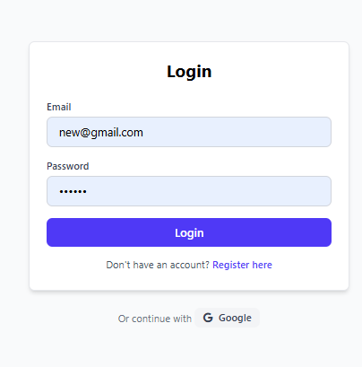
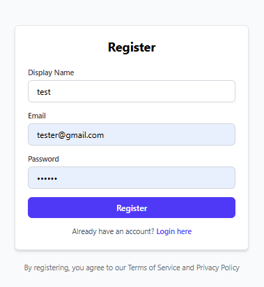

# QuizGamifiAi 🎯

A comprehensive quiz gamification platform that transforms learning into an engaging, competitive experience. Built with React, Firebase, and AI-powered features to create, manage, and participate in interactive quizzes.

## 🌟 Features Overview

### 🔐 Authentication & User Management

- **Secure Authentication**: Email/password login and registration
- **User Profiles**: Personalized user accounts with progress tracking
- **Profile Management**: Display names, avatars, and account settings




### 📊 Interactive Dashboard

- **Real-time Statistics**: Dynamic XP tracking, quiz completion counts, and performance metrics
- **Weekly Progress**: Percentage changes and weekly quiz completion tracking
- **Performance Charts**: Visual representation of quiz performance over time
- **Personalized Suggestions**: AI-driven recommendations based on user performance


### 🎯 Quiz Creation & Management

- **Manual Quiz Creation**: Create custom quizzes with multiple-choice questions
- **AI-Powered PDF Generation**: Upload PDF documents and automatically generate quizzes using AI
- **Edit & Delete**: Full CRUD operations for quiz questions before publishing
- **Rich Question Editor**: Support for multiple-choice questions with correct answer marking
- **Category & Difficulty**: Organize quizzes by subject and difficulty level


### 🎮 Gamified Quiz Experience

- **Interactive Quiz Interface**: Smooth, engaging quiz-taking experience
- **Real-time Scoring**: Immediate feedback and score calculation
- **XP & Leveling System**: Earn experience points and level up
- **Performance Tracking**: Detailed analytics for each quiz attempt
- **Timer Support**: Optional time limits for competitive quizzing


### 🏆 Gamification Elements

- **XP System**: Earn experience points for quiz completion and performance
- **Level Progression**: User levels based on accumulated XP
- **Badge System**: Achievement badges for various milestones
- **Leaderboards**: Competitive rankings based on performance
- **Streak Tracking**: Maintain quiz completion streaks


### 📈 Analytics & Progress Tracking

- **Performance History**: Track quiz performance over time
- **Weekly Statistics**: Dynamic weekly progress indicators
- **Rank Tracking**: Monitor position changes in global rankings
- **Detailed Metrics**: Comprehensive analytics dashboard


### 🤖 AI Assistant

- **Intelligent Chatbot**: AI-powered assistant for quiz help and guidance
- **Contextual Support**: Personalized assistance based on user progress
- **Learning Recommendations**: AI-driven suggestions for improvement


### 📱 Responsive Design

- **Mobile-First**: Optimized for all device sizes
- **Touch-Friendly**: Enhanced mobile interactions
- **Cross-Platform**: Consistent experience across devices


### 🔧 Technical Features

- **Real-time Database**: Firebase Firestore for instant data synchronization
- **File Upload**: PDF processing for AI quiz generation
- **Security**: Secure authentication and data protection
- **Performance**: Optimized loading and caching
- **Error Handling**: Comprehensive error management

## 🛠️ Technology Stack

### Frontend

- **React 18**: Modern React with hooks and functional components
- **React Router**: Client-side routing for SPA navigation
- **Tailwind CSS**: Utility-first CSS framework for styling
- **FontAwesome**: Icon library for UI elements

### Backend & Services

- **Firebase Authentication**: Secure user authentication
- **Firebase Firestore**: NoSQL database for real-time data
- **Node.js Backend**: Express server for AI processing
- **AI Integration**: PDF processing and quiz generation

### Development Tools

- **Vite**: Fast build tool and development server
- **ESLint**: Code linting and formatting
- **Git**: Version control

## 🚀 Getting Started

### Prerequisites

- Node.js (v16 or higher)
- npm or yarn package manager
- Firebase account
- Git

### Installation Steps

1. **Clone the Repository**

   ```bash
   git clone https://github.com/shkhfzn9/QuizGamifiAi.git
   cd QuizGamifiAi
   ```

2. **Install Dependencies**

   ```bash
   # Install frontend dependencies
   cd QuizGamification
   npm install

   # Install backend dependencies (if applicable)
   cd ../backend
   npm install
   ```

3. **Firebase Setup**

   a. Create a new Firebase project at [Firebase Console](https://console.firebase.google.com/)

   b. Enable Authentication with Email/Password provider

   c. Create a Firestore database

   d. Get your Firebase configuration and create `.env` file:

   ```bash
   # In QuizGamification folder
   cp .env.example .env
   ```

   e. Add your Firebase configuration to `.env`:

   ```env
   VITE_FIREBASE_API_KEY=your_api_key
   VITE_FIREBASE_AUTH_DOMAIN=your_project.firebaseapp.com
   VITE_FIREBASE_PROJECT_ID=your_project_id
   VITE_FIREBASE_STORAGE_BUCKET=your_project.appspot.com
   VITE_FIREBASE_MESSAGING_SENDER_ID=your_sender_id
   VITE_FIREBASE_APP_ID=your_app_id
   ```

4. **Backend Setup (for AI features)**

   ```bash
   # In backend folder
   npm install

   # Add your OpenAI API key to backend .env
   OPENAI_API_KEY=your_openai_api_key
   PORT=5000
   ```

5. **Start Development Servers**

   ```bash
   # Start backend server (Terminal 1)
   cd backend
   npm start

   # Start frontend development server (Terminal 2)
   cd QuizGamification
   npm run dev
   ```

6. **Access the Application**
   - Frontend: `http://localhost:5173`
   - Backend: `http://localhost:5000`

### Firestore Database Structure

The application uses the following Firestore collections:

```
/users/{userId}
  - displayName: string
  - email: string
  - xp: number
  - level: number
  - quizzesCompleted: number
  - badges: array
  - quizPerformance: array
  - weeklyStats: object
  - createdAt: timestamp

/quizzes/{quizId}
  - title: string
  - category: string
  - difficulty: string
  - description: string
  - questions: array
  - createdAt: timestamp
  - timeEstimate: string
```

## 📝 Usage Guide

### Creating Your First Quiz

1. **Navigate to Upload Quiz Page**

   - Click on "Upload" tab in navigation

2. **Choose Creation Method**

   - **Manual**: Create questions manually
   - **PDF**: Upload PDF and let AI generate questions

3. **Fill Quiz Details**

   - Quiz title and category
   - Difficulty level
   - Description

4. **Add Questions**

   - Question text
   - Four answer options
   - Mark correct answer

5. **Edit/Delete Questions**

   - Use edit icon to modify questions
   - Use delete icon to remove questions

6. **Save Quiz**
   - Review all questions
   - Click "Save Quiz" to publish

### Taking Quizzes

1. **Browse Available Quizzes**

   - Go to "Quizzes" tab
   - Filter by category or difficulty

2. **Start Quiz**

   - Click on any quiz to begin
   - Read instructions carefully

3. **Answer Questions**

   - Select your answer for each question
   - Navigate between questions

4. **View Results**
   - See your score and XP earned
   - Review correct answers
   - Track your progress

## 🎯 Key Features Guide

### Dashboard Analytics

- **XP Tracking**: Monitor your learning progress
- **Weekly Changes**: See percentage improvements
- **Quiz History**: Review past performance
- **Personalized Insights**: Get AI-powered recommendations

### Gamification System

- **Experience Points**: Earn XP for every quiz
- **Levels**: Progress through different skill levels
- **Badges**: Unlock achievements for milestones
- **Leaderboards**: Compete with other users

### AI-Powered Features

- **PDF Quiz Generation**: Convert documents to quizzes
- **Smart Recommendations**: Personalized learning paths
- **Chatbot Assistant**: Get help and guidance
- **Performance Analytics**: AI-driven insights

## 🔧 Configuration

### Environment Variables

**Frontend (.env)**

```env
VITE_FIREBASE_API_KEY=
VITE_FIREBASE_AUTH_DOMAIN=
VITE_FIREBASE_PROJECT_ID=
VITE_FIREBASE_STORAGE_BUCKET=
VITE_FIREBASE_MESSAGING_SENDER_ID=
VITE_FIREBASE_APP_ID=
```

**Backend (.env)**

```env
OPENAI_API_KEY=
PORT=5000
CORS_ORIGIN=http://localhost:5173
```

### Firebase Security Rules

**Firestore Rules**

```javascript
rules_version = '2';
service cloud.firestore {
  match /databases/{database}/documents {
    match /users/{userId} {
      allow read, write: if request.auth != null && request.auth.uid == userId;
    }
    match /quizzes/{quizId} {
      allow read: if request.auth != null;
      allow write: if request.auth != null;
    }
  }
}
```

## 🤝 Contributing

We welcome contributions! Please follow these steps:

1. Fork the repository
2. Create a feature branch (`git checkout -b feature/AmazingFeature`)
3. Commit your changes (`git commit -m 'Add AmazingFeature'`)
4. Push to the branch (`git push origin feature/AmazingFeature`)
5. Open a Pull Request

### Development Guidelines

- Follow React best practices
- Use TypeScript for new components
- Write comprehensive tests
- Follow the existing code style
- Update documentation for new features

## 📁 Project Structure

```
QuizGamifiAi/
├── QuizGamification/                 # Frontend React application
│   ├── src/
│   │   ├── components/              # React components
│   │   │   ├── common/             # Shared components
│   │   │   ├── dashboard/          # Dashboard components
│   │   │   ├── quizzes/           # Quiz-related components
│   │   │   ├── ui/                # UI components
│   │   │   └── chatbot/           # AI chatbot components
│   │   ├── pages/                 # Page components
│   │   ├── hooks/                 # Custom React hooks
│   │   ├── context/               # React context providers
│   │   ├── firebase/              # Firebase configuration
│   │   └── utils/                 # Utility functions
│   ├── public/                    # Static assets
│   └── package.json
├── backend/                       # Backend server (if applicable)
│   ├── routes/                    # API routes
│   ├── middleware/                # Express middleware
│   └── package.json
└── README.md
```

## 🔍 Troubleshooting

### Common Issues

**Firebase Connection Issues**

- Verify your Firebase configuration
- Check if authentication is enabled
- Ensure Firestore rules allow access

**PDF Upload Not Working**

- Check if backend server is running
- Verify OpenAI API key is set
- Ensure CORS is configured properly

**Build Errors**

- Clear node_modules and reinstall
- Check Node.js version compatibility
- Verify all environment variables are set

### Getting Help

- Check the [Issues](https://github.com/your-username/QuizGamifiAi/issues) page
- Join our [Discord community](https://discord.gg/your-invite)
- Read the [Documentation](https://docs.your-domain.com)

## 📄 License

This project is licensed under the MIT License - see the [LICENSE](LICENSE) file for details.

## 🙏 Acknowledgments

- React team for the amazing framework
- Firebase for backend services
- OpenAI for AI capabilities
- Tailwind CSS for styling
- All contributors and testers

## 📞 Contact

- **Project Maintainer**: Sheikh Faizan
- **Email**: sheikhfaizan.w@gmail.com
- **LinkedIn**: [Sheikh Faizan](https://www.linkedin.com/in/sheikh-faizan-4a9a29326/)

---

**Made with ❤️ by the Sheikh Faizan**

_Transform your learning experience with gamified quizzes!_
